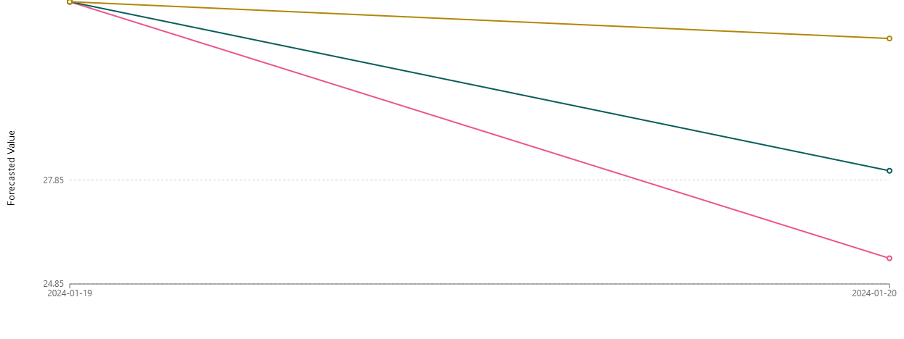

# 📊 Previsão de Estoque Inteligente na AWS com [SageMaker Canvas](https://aws.amazon.com/pt/sagemaker/canvas/)

Trata-se de um desafio lançado no Bootcamp Nexa - Machine Learning para Iniciantes na AWS pela DIO, utilizando o SageMaker Canvas para criar previsões de estoque baseadas em Machine Learning (ML).

Autor: Leandro da Silva Stampini

## 🎯 Objetivos Deste Desafio de Projeto (Lab)

O SageMaker Canvas é uma ferramenta incrível aonde você realiza todo processamento de dados sem codificar. Apesar desta ferramenta realizar o trabalho pesado, sugiro um aprendizado profundo na codificação e no entendimento das métricas geradas para melhor compreenção do trabalho realizado, que passa pelo tratamento do Dataset, a construção do modelo ML, a análise e suas devidas predições.

## 🚀 Passo a Passo

### 1. Selecionar Dataset

O Dataset selecionado é constituído pelas colunas:
- ID_PRODUTO, com valores unívocos que identificam os produtos;
- DIA, uma coluna em formato datetime;
- FLAG_PROMOCAO, com valores 0 e 1, indicando produto em promoção;
- QUANTIDADE_ESTOQUE, indicando a quantidade em estoque de determinado produto;
Os dados foram verificados e limpos, evitando valores duplicados.

Arquivo utilizado no Canvas:

- `scripts/dados_utilizados.csv` (500 linhas de dados + header; 25 produtos; 20 datas, de 2023-12-31 a 2024-01-19)

### 2. Construir/Treinar

Para a Construção do modelo, a coluna alvo de predição "QUANTIDADE_ESTOQUE" foi selecionada, o próprio SageMaker Canvas
sugere o modelo mais adequado, uma Série Temporal (ideal para previsão de valores futuros), onde é necessário identificar a coluna com valores que representam os produtos e tem a opção 
de incluir peculiaridades de calendário, como os feriados.

### 3. Analisar

Após o treinamento do modelo anteriormente selecionado, obtemos as métricas:

- AVG wQL: 0.086 (um valor baixo indica um modelo mais preciso, pois trata-se da perda média dos quartis)
- MAPE: 0.290 (diferença percentual entre o valor médio previsto e o valor real, logo um valor baixo indica mais precisão)
- WAPE: 0.152 (erro percentual absoluto, um valor baixo indica maior precisão)
- RMSE: 1.535 (é uma medida de erro absoluto que eleva os desvios ao quadrado para impedir que os desvios positivos e negativos se cancelem. Quanto mais próximo de zero, maior a precisão)
- MASE: 0.180 (Erro médio em escala absoluta, Um valor mais baixo indica um modelo mais preciso com MASE < 1 como um modelo estimado como melhor que a linha de base e um MASE > 1 como um modelo estimado como pior que a linha de base.)

Nenhuma coluna influencia nas métricas do modelo.

### 4. Prever

Com o modelo ajustado, conseguimos fazer previsões do estoque sobre cada produto.
Nossa previsão apresenta três tipos de valores; Uma previsão com valor otimista, valor pessimista e valor de meio termo.
Esses valores auxiliam na tomada de decisão para criação ou manutenção de estoque, alinhado ao conhecimento de negócio, como sazonalidade de um certo produto.

## 📎 Evidências geradas (pasta scripts)

- Dataset usado: `scripts/dados_utilizados.csv`
- Resultado exportado de previsão (single prediction): `scripts/single_prediction_results.csv`
- Print do resultado: `scripts/single_prediction_results.png`

